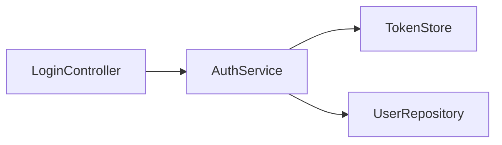

# graph2md

[](https://go.dev)
[](LICENSE)
[](#)

**Convert Supermodel architecture graphs into markdown documentation.**

```
1 graph JSON -> 1,997 markdown files with frontmatter, FAQs, and Mermaid diagrams
```

## Why

[Supermodel](https://supermodeltools.com) generates architecture graphs — rich JSON representations of codebases with nodes (functions, classes, modules) and edges (calls, imports, inherits). graph2md turns these graphs into a directory of standalone markdown files, ready for any static site generator.

Each entity gets:

- YAML frontmatter (title, description, node_type, language, domain, tags, etc.)
- Mermaid dependency diagrams (incoming and outgoing relationships)
- Source code blocks with syntax highlighting
- Auto-generated FAQ sections
- Graph metadata (relationship counts, complexity metrics)

## Quick Start

```bash
go install github.com/supermodeltools/graph2md@latest

graph2md -input graph.json -output ./content
```

### Flags

| Flag | Default | Description |
|------|---------|-------------|
| `-input` | `graph.json` | Path to Supermodel graph JSON |
| `-output` | `./content` | Output directory for markdown files |
| `-enrichments` | `./enrichments` | Directory for enrichment JSON sidecar files |
| `-config` | `pssg.yaml` | Path to pssg config (updates content path) |

## Output

For each node in the graph, graph2md generates a markdown file like:

```markdown
---
title: "AuthService"
slug: "authservice"
node_type: "Class"
language: "TypeScript"
domain: "auth"
subdomain: "core"
tags: ["authentication", "service"]
---

## Description
Handles user authentication and session management.

## Dependencies


## Source
\```typescript
export class AuthService { ... }
\```
```

## Architecture

Single-file Go program. 2,188 lines. Zero external dependencies.

Reads Supermodel's `APIResponse` JSON format, walks the graph nodes and edges, and writes one `.md` file per entity with full frontmatter and content sections.
